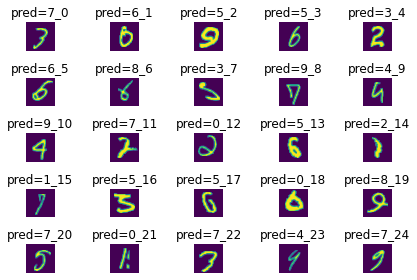
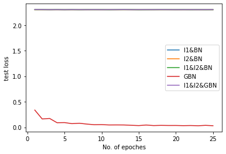
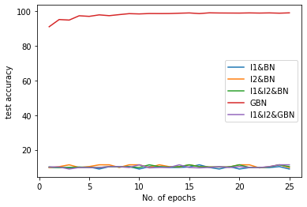

# Misclassified on GBN model

# validation loss

# validation accuracy

# Files

* utils.py is used for train and validation, model saving, running epoches based dictionary of regularization
* feedforward.py is have model architectures
* gbn.py have ghost batch normaliztion
* data.py is used for dataloaders,transformation.
* notebook integration for ploting above images
