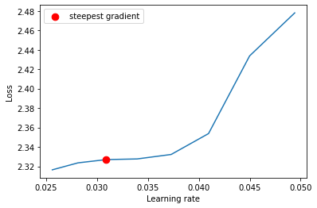

# accuracy for train and test curve

# misclassified images with gradcam

# lr curve

# Description

* gradcam technique is implemented in gradcamtool.py
* cut out implemented in data.py
* LR finder is implement in notebook
* achieved more than 86 % test accuracy in 50 epoches
