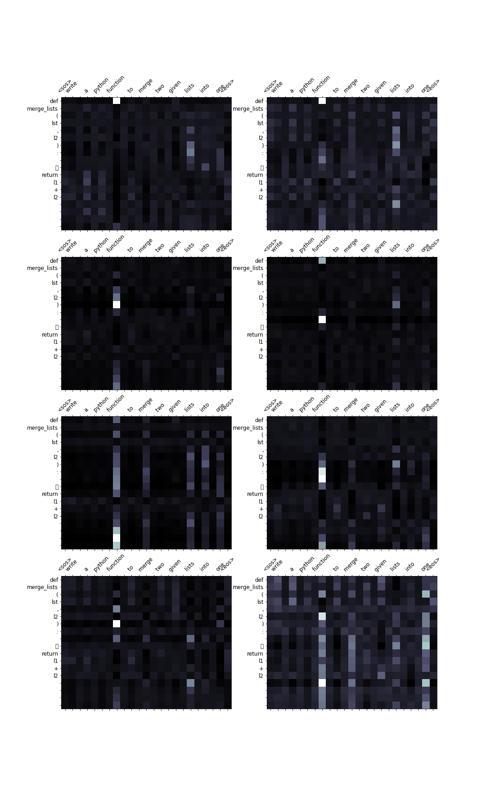

# Code for Captone is [click here.](./Capstone.ipynb) 

# Data Cleaning:
 * The Dataset is a text file with pair's of english text and python code.
 * Each example is seperated by a new_line character and '#' symbol**(\n#) **.
 * Additionally some sentences start with a space after the '#' symbol and some don't, to remove them the queue is first tokenised and          checked for space's in the beginning of the sentence.

# Data Preparation:
 * During the training of the model it was found that two similar english text's when passed through the model would give different result      even though they mean the same. for this solution.  
 * "write","program","function","to",......Due to this the total examples have doubled and is working as an augmentation technique.This change although improved the result of some english text's not all of them were giving the expected result.      
 * As an attempt to overcome this problem the english text is modified to remove some common words like          "write","program","function","to",... Due to this the total examples have doubled and is working as an augmentation technique.
 * This change although improved the result of some  queue's not all of them were giving the expected result

# Model Architecture:
 * [click here.](https://www.linkedin.com/pulse/transformers-siva-vamsi/?trackingId=I%2BRg%2B0s7Sw2BN7qgcastdg%3D%3D) 
 * Python code embeddings which got from word to vec model copied to decoder of transformer
 * max lenght of code capacity is 500
 
# Loss function:
 * combination of 99.5 %of crossentropy + 0.5 % of hindge loss.

# Python Code Embedding:
 * Python code snippet's are first tokenised using the tokenize library. 
 * "INDENT" token is given special care and indent(4 space's) are replaced by "\t". 
 * Some snippet's contain irregular number of space's which are rounded off. 
 * Each snippet is tokenised and all the tokenised snippet's are appended to a list which is used to train the embedding's. 
 * Embedding's are trained using the gensim library Word2Vec for a total of 100 epoch's. 
 * All other parameter's of the Word2Vec model is kept default. 
 * The Dimension of the Word2Vec embedding's are same as the Dimension of the embedding layer present in the decoder part of the Transformer arhitecture. 
 * This is important so that the embedding vector's from Word2Vec can be transformed to the embedding of the decoder in transformer's architecture.

# Evaluation Metrics:
 * BLEU score = 46.50 

# Attention graph/images between text and "python-code"

# "25"  example output from your model
####################################################################################################
queue:
#  write  a  python  program  to  add  two  numbers 
**************************************************

snippet:

num1 = 1.5 
 num2 = 6.3 
 sum = num1 + num2 
 print ( f'Sum: {sum}' )  
**************************************************

predicted:
num1 = 1.5 
 num2 = 6.3 
 sum = num1 + num2 
 print ( f'Sum: {sum}' )  
####################################################################################################

####################################################################################################
queue:
write  a  python  function  to  add  two  user  provided  numbers  and  return  the  sum
**************************************************

snippet:

def add_two_numbers ( num1 , num2 ) : 
 	 sum = num1 + num2 
 return sum   
**************************************************

predicted:
def add_two_numbers ( num1 , num2 ) : 
 	 sum = num1 + num2 
 return sum   
####################################################################################################

####################################################################################################
queue:
write  a  program  to  find  and  print  the  largest  among  three  numbers
**************************************************

snippet:

num1 = 10 
 num2 = 12 
 num3 = 14 
 if ( num1 >= num2 ) and ( num1 >= num3 ) : 
 	 largest = num1 
  elif ( num2 >= num1 ) and ( num2 >= num3 ) : 
 	 largest = num2 
  else : 
 	 largest = num3 
  print ( f'largest:{largest}' )  
**************************************************

predicted:
num1 = 10 
 num2 = 12 
 num3 = 14 
 if ( num1 >= num2 ) and ( num1 >= num3 ) : 
 	 largest = num1 
  elif ( num2 >= num1 ) and ( num2 >= num3 ) : 
 	 largest = num2 
  else : largest = num3 
 print ( f'largest:{largest}' )  
####################################################################################################

####################################################################################################
queue:
write  a  program  to  find  and  print  the  smallest  among  three  numbers
**************************************************

snippet:

num1 = 10 
 num2 = 12 
 num3 = 14 
 if ( num1 <= num2 ) and ( num1 <= num3 ) : 
 	 smallest = num1 
  elif ( num2 <= num1 ) and ( num2 <= num3 ) : 
 	 smallest = num2 
  else : 
 	 smallest = num3 
  print ( f'smallest:{smallest}' )  
**************************************************

predicted:
num1 = 10 
 num2 = 12 
 num3 = 14 
 if ( num1 <= num2 ) and ( num1 <= num3 ) : 
 	 smallest = num1 
  elif ( num2 <= num1 ) and ( num2 <= num3 ) : 
 	 smallest = num3 
  else : 
 	 smallest = num3 
  print ( f'smallest:{smallest}' )  
####################################################################################################

####################################################################################################
queue:
Write  a  python  function  to  merge  two  given  lists  into  one
**************************************************

snippet:

def merge_lists ( l1 , l2 ) : 
 	 return l1 + l2   
**************************************************

predicted:
def merge_lists ( l1 , l2 ) : 
 	 return l1 + l2   
####################################################################################################

####################################################################################################
queue:
Write  a  program  to  check  whether  a  number  is  prime  or  not
**************************************************

snippet:

num = 337 
 
 if num > 1 : 
 	 for i in range ( 2 , num // 2 + 1 ) : 
 	 	 if ( num % i ) == 0 : 
 	 	 	 print ( num , "is not a prime number" ) 
 print ( f"{i} times {num//i} is {num}" ) 
 break 
  else : 
 	 	 	 print ( f"{num} is a prime number" ) 
 break 
 
    else : 
 	 print ( f"{num} is not a prime number" )   
**************************************************

predicted:
num = 337 
 if num > 1 : 
 	 for i in range ( 2 , num ) : 
 	 	 if ( num % i ) == 0 : 
 	 	 	 print ( num , "is not a prime number" ) 
 print ( f"{i} times {num//i} is {num}" ) 
 print ( f"{i} times {num//i} is {num}" ) 
 break 
  else : 
 	 	 	 print ( f"{num} is a prime number" ) 
 break 
   else : 
 	 	 print ( f"{num} is a prime number" ) 
   else : 
 	 print ( f"{num} is not a prime number" )  
####################################################################################################

####################################################################################################
queue:
Write  a  python  function  that  prints  the  factors  of  a  given  number
**************************************************

snippet:

def print_factors ( x ) : 
 	 print ( f"The factors of {x} are:" ) 
 for i in range ( 1 , x + 1 ) : 
 	 	 if x % i == 0 : 
 	 	 	 print ( i )     
**************************************************

predicted:
def print_factors ( x ) : 
 	 print ( f"The factors of {x} are:" ) 
 for i in range ( 1 , x + 1 ) : 
 	 	 if x % i == 0 : 
 	 	 	 print ( i )     
####################################################################################################

####################################################################################################
queue:
Write  a  program  to  find  the  factorial  of  a  number
**************************************************

snippet:

num = 13 
 factorial = 1 
 
 if num < 0 : 
 	 print ( "No factorials for negative numbers!" ) 
 
  elif num == 0 : 
 	 print ( "The factorial of 0 is 1" ) 
 
  else : 
 	 for i in range ( 1 , num + 1 ) : 
 	 	 factorial = factorial * i 
  print ( f"The factorial of {num} is {factorial}" )   
**************************************************

predicted:
num = int ( input ( "Enter a number: " ) ) 
 factorial = 1 
 if num < 0 : 
 	 print ( "Sorry, factorial does not exist for negative numbers" ) 
  elif num == 0 : 
 	 for i in range ( 1 , num + 1 ) : 
 	 	 factorial = factorial * i 
  print ( "The factorial of" , num , num , num , "is" , factorial ) 
 
  findfactorial = int ( input ( num ) ) 
 print ( fact , num )  
####################################################################################################

####################################################################################################
queue:
Write  a  python  function  to  print  whether  a  number  is  negative ,  positive  or  zero
**************************************************

snippet:

def check_pnz ( num ) : 
 	 if num > 0 : 
 	 	 print ( "Positive number" ) 
  elif num == 0 : 
 	 	 print ( "Zero" ) 
  else : 
 	 	 print ( "Negative number" )    
**************************************************

predicted:
def check_pnz ( num ) : 
 	 if num > 0 : 
 	 	 print ( "Positive number" ) 
  elif num == 0 : 
 	 	 print ( "Zero" ) 
  else : 
 	 	 print ( "Negative number" )    
####################################################################################################

####################################################################################################
queue:
Write  a  program  to  print  the  multiplication  table  of  a  given  number
**************************************************

snippet:

num = 9 
 for i in range ( 1 , 11 ) : 
 	 print ( f"{num} x {i} = {num*i}" )   
**************************************************

predicted:
num = 9 
 for i in range ( 1 , 11 ) : 
 	 print ( f"{num} x {i} = {num*i}" )   
####################################################################################################

####################################################################################################
queue:
Write  a  python  function  to  print  powers  of  2 ,  for  given  number  of  terms
**************************************************

snippet:

def two_power ( terms ) : 
 	 result = list ( map ( lambda x : 2 ** x , range ( terms ) ) ) 
 
 print ( f"The total terms are: {terms}" ) 
 for i in range ( terms ) : 
 	 	 print ( f"2^{i} = {result[i]}" )    
**************************************************

predicted:
def two_power ( terms ) : 
 	 result = list ( map ( lambda x : 2 ** x , range ( terms ) ) ) 
 
 print ( f"The total terms are: {terms}" ) 
 for i in range ( terms ) : 
 	 	 print ( f"2^{i} = {result[i]}" )    
####################################################################################################

####################################################################################################
queue:
Write  a  program  to  filter  the  numbers  in  a  list  which  are  divisible  by  a  given  number
**************************************************

snippet:

my_list = [ 11 , 45 , 74 , 89 , 132 , 239 , 721 , 21 ] 
 
 num = 3 
 result = list ( filter ( lambda x : ( x % num == 0 ) , my_list ) ) 
 
 print ( f"Numbers divisible by {num} are {result}" )  
**************************************************

predicted:
my_list = [ 11 , 45 , 74 , 89 , 132 , 239 , 721 , 21 , 89 , 45 , 89 , 
 
 
 result = list ( filter ( lambda x : ( x % num == 0 ) ) ) 
 print ( f"Numbers divisible by {num} are {result}" )  
####################################################################################################

####################################################################################################
queue:
Write  a  python  function  that  returns  the  sum  of  n  natural  numbers
**************************************************

snippet:

def sum_natural ( num ) : 
 	 if num < 0 : 
 	 	 print ( "Please enter a positive number!" ) 
  else : 
 	 	 sum = 0 
 while ( num > 0 ) : 
 	 	 	 sum += num 
 num -= 1 
  return num    
**************************************************

predicted:
def sum_natural ( num ) : 
 	 if num < 0 : 
 	 	 print ( "Please enter a positive number!" ) 
  else : 
 	 	 sum = 0 
 while ( num > 0 ) : 
 	 	 	 sum += num 
 num -= 1 
  return num    
####################################################################################################

####################################################################################################
queue:
Write  a  program  to  swap  first  and  last  elements  in  a  list
**************************************************

snippet:

my_list = [ 1 , 2 , 3 , 4 , 5 , 6 ] 
 my_list [ 0 ] , my_list [ - 1 ] = my_list [ - 1 ] , my_list [ 0 ]  
**************************************************

predicted:
my_list = [ 1 , 2 , 3 , 4 , 5 , 6 ] 
 my_list [ - 1 ] , my_list [ - 1 ] , my_list [ 0 ] , my_list [ 0 ]  
####################################################################################################

####################################################################################################
queue:
Write  a  python  function  to  find  the  area  of  a  circle ,  whose  radius  is  given
**************************************************

snippet:

def findArea ( r ) : 
 	 PI = 3.142 
 return PI * ( r * r )   
**************************************************

predicted:
def findArea ( r ) : 
 	 PI = 3.142 
 return PI * r * r   
####################################################################################################

####################################################################################################
queue:
Write  a  program  to  print  the  sum  of  squares  of  first  n  natural  numbers
**************************************************

snippet:

n = 21 
 sum_n = 0 
 for i in range ( 1 , n + 1 ) : 
 	 sum_n += i ** 2 
  print ( sum_n )  
**************************************************

predicted:
n = 21 
 sum_n = 0 
 for i in range ( 1 , n + 1 ) : 
 	 sum_n += i ** 2 
  print ( sum_n )  
####################################################################################################

####################################################################################################
queue:
Write  a  program  to  print  the  length  of  a  list
**************************************************

snippet:

my_list = [ 1 , 2 , 3 , 4 , 5 , 6 , 7 , 8 , 9 ] 
 
 print ( len ( my_list ) )  
**************************************************

predicted:
print ( len ( l ) )  
####################################################################################################

####################################################################################################
queue:
Write  a  pythno  function  to  print  the  length  of  a  given  tuple
**************************************************

snippet:

my_tuple = ( 1 , 2 , 3 , 4 , 5 , 6 , 7 , 8 ) 
 
 print ( len ( my_tuple ) )  
**************************************************

predicted:
my_tuple = ( 1 , 2 , 3 , 4 , 5 , 6 , 7 , 8 , 9 , 1 ) 
 print ( len ( my_tuple ) )  
####################################################################################################

####################################################################################################
queue:
Write  a  python  function  to  print  the  elements  of  a  given  list ,  one  element  in  a  line
**************************************************

snippet:

def custom_print ( l ) : 
 	 for _ in l : 
 	 	 print ( _ )    
**************************************************

predicted:
def test_list ( test_list ) : 
 	 for i in range ( 5 ) : 
 	 	 if ( i == 3 ) : 
 	 	 	 	 break 
   print ( res )   
####################################################################################################

####################################################################################################
queue:
Write  a  python  function  to  remove  all  the  odd  numbers  from  a  list  and  return  the  remaining  list
**************************************************

snippet:

def remove_odd ( my_list ) : 
 	 result = list ( filter ( lambda x : ( x % 2 == 0 ) , my_list ) ) 
 return result   
**************************************************

predicted:
def remove_even ( my_list ) : 
 	 result = list ( filter ( lambda x : ( x % 2 != 0 ) , my_list ) ) 
 return result   
####################################################################################################

####################################################################################################
queue:
Write  a  python  function  to  remove  all  the  even  numbers  from  a  list  and  return  the  remaining  list
**************************************************

snippet:

def remove_even ( my_list ) : 
 	 result = list ( filter ( lambda x : ( x % 2 != 0 ) , my_list ) ) 
 return result   
**************************************************

predicted:
def remove_even ( my_list ) : 
 	 result = list ( filter ( lambda x : ( x % 2 != 0 ) , my_list ) ) 
 return result   
####################################################################################################

####################################################################################################
queue:
Write  a  function  that  takes  two  lists  as  input  and  returns  a  zipped  list  of  corresponding  elements
**************************************************

snippet:

def zip_list ( list1 , list2 ) : 
 	 return list ( zip ( list1 , list2 ) )   
**************************************************

predicted:
def zip_list ( list1 , list2 ) : 
 	 return list ( zip ( list1 , list2 ) )   
####################################################################################################

####################################################################################################
queue:
Write  a  program  to  to  print  the  contents  of  a  given  file
**************************************************

snippet:

file_name = 'temp.txt' 
 with open ( file_name , 'r' ) as f : 
 	 print ( f . read ( ) )   
**************************************************

predicted:
file_name = 'temp.txt' 
 with open ( file_name , 'r' ) as f : 
 	 print ( f . read ( ) )   
####################################################################################################

####################################################################################################
queue:
Write  a  functin  that  returns  the  LCM  of  two  input  numbers
**************************************************

snippet:

def lcm ( a , b ) : 
 	 if a > b : 
 	 	 min_ = a 
  else : 
 	 	 min_ = b 
  while True : 
 	 	 if min_ % a == 0 and min_ % b == 0 : 
 	 	 	 break 
  min_ += 1 
  return min_   
**************************************************

predicted:
def lcm ( a , b ) : 
 	 if a > b : 
 	 	 greater = a 
  else : 
 	 	 min_ = b 
  while True : 
 	 	 if ( ( lcm == a and min_ % b == 0 ) ) : 
 	 	 lcm = lcm 
 break 
  return min_   
####################################################################################################

####################################################################################################
queue:
Write  a  program  to  print  the  unique  elements  in  a  list
**************************************************

snippet:

my_list = [ 1 , 2 , 4 , 5 , 2 , 3 , 1 , 5 , 4 , 7 , 8 , 2 , 4 , 5 , 2 , 7 , 3 ] 
 
 print ( set ( my_list ) )  
**************************************************

predicted:
my_list = [ 1 , 2 , 3 , 4 , 5 , 6 , 7 , 8 , 4 , 2 , 7 , 8 , 1 , 2 , 4 , 5 , 7 , 8 , 2 , 2 , 4 , 3 , 5 , 8 , 4 , 7 , 1 ] 
 print ( unique )  
####################################################################################################

